# NxVMS_OS Install
Working files and tools for creating an unattended Ubuntu LTS Install. You will need to be running linux on your machine or a VM to create the bootable disk, the commands below will guide you. 

MAKE SURE YOU HAVE ATLEAST 20gb SPACE AVAILABLE ON YOUR SYSTEM HDD

# Warning
This will create a bootable linux usb install disk that will wipe any computer that boots it automatically, don't leave it in a machine you don't want to wipe.

## Download Cubic Tool to create the ISO
Download some tools to get your environment ready
```
sudo apt-add-repository ppa:cubic-wizard/release
sudo apt update
sudo apt install cubic
```

## Download Ubuntu
Go to http://releases.ubuntu.com/ and Select the latest LTS Desktop Image, download it to ~/Downloads

## Download necessary boot files to automate installation
There are 3 modified files that are required:
/boot/grub/grub.cfg
/isolinux/txt.cfg
/preseed/nessvms.seed

Clone this Git Repository to download these files
```
cd
mkdir -p ~/git
cd git
git clone https://github.com/kvellaNess/NxVMS_OS.git
```

Create a working Directory
```
sudo mkdir -p ~/cubic_ubuntu
```

## Run Cubic
Launch Cubic from the dock or application menu.

Select the working directory as ~/cubic_ubuntu

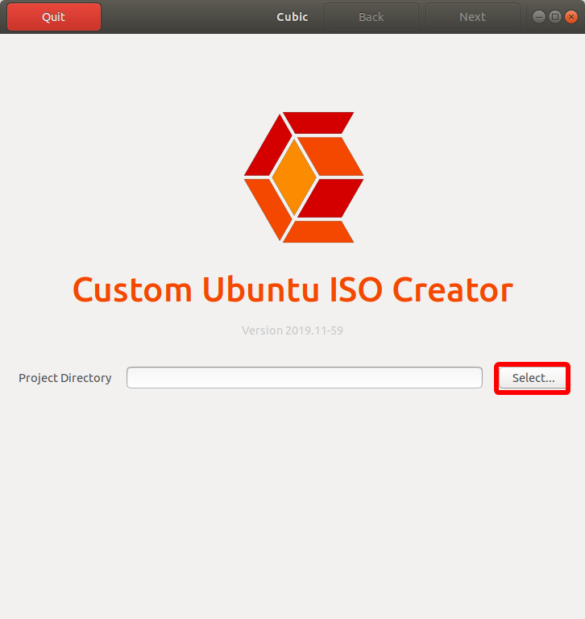
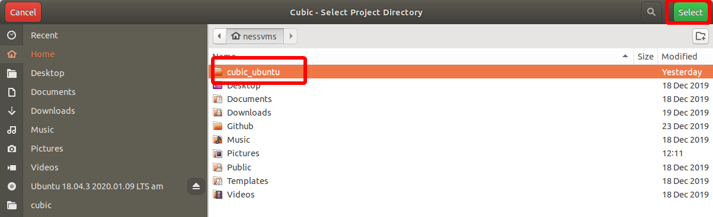

## Select the Ubuntu LTS iso you just downloaded
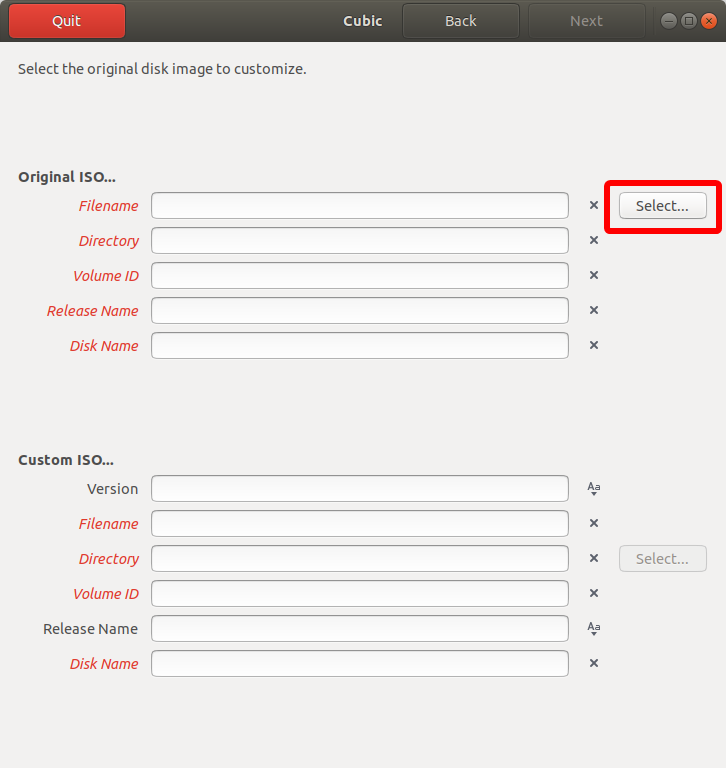
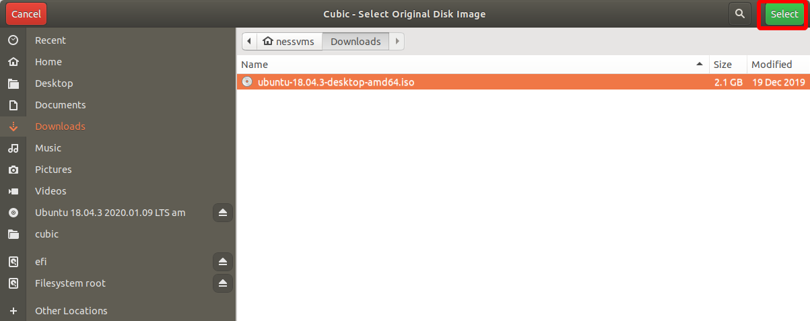

## Customise the release as you wish and press next
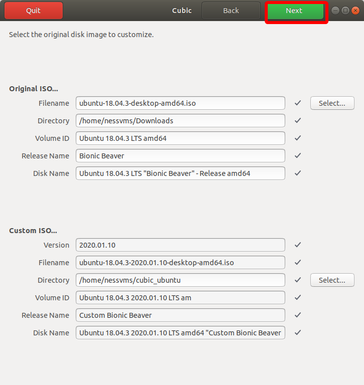

## Skip past the terminal modification screen
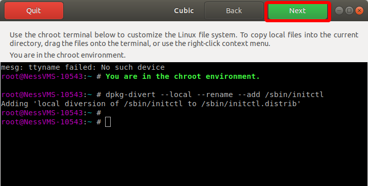

## Add preseed file
These steps are *critical* that you compelte correctly. Add a new preseed file and call it ```nessvms.seed``` Open up the file manager and navigate to home\git\preseed. Open the nessvms.seed file and copy and paste the contents back in to cubic in to the new entry you have created.

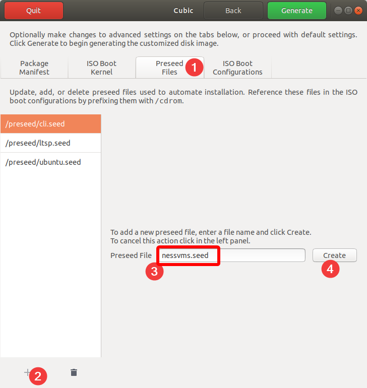
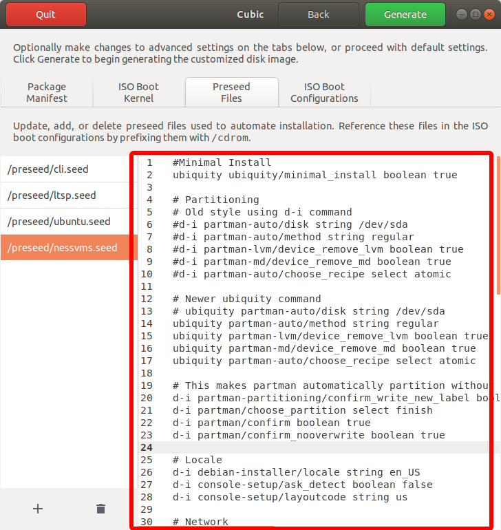

## Edit Boot configuration files
Similarly we must overwrite the 3 Boot config files contents with the contents of the files in  those that are in home\git\boot & home\git\isolinux

Completely overwrite and replace all the text in the existing files with the text from the git folder files

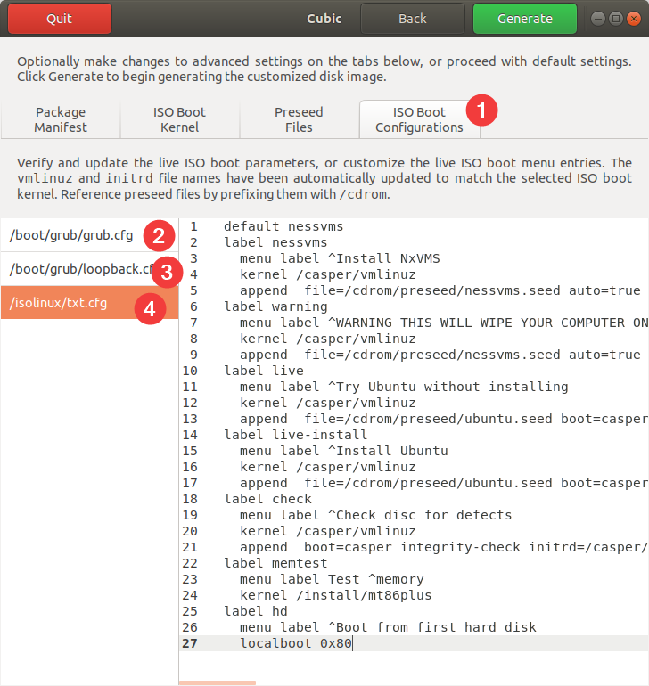

Once you have done that you can click Generate

## Generate USB ISO
The new OS Image ISO will now be generated and placed inside home/cubic_ubuntu

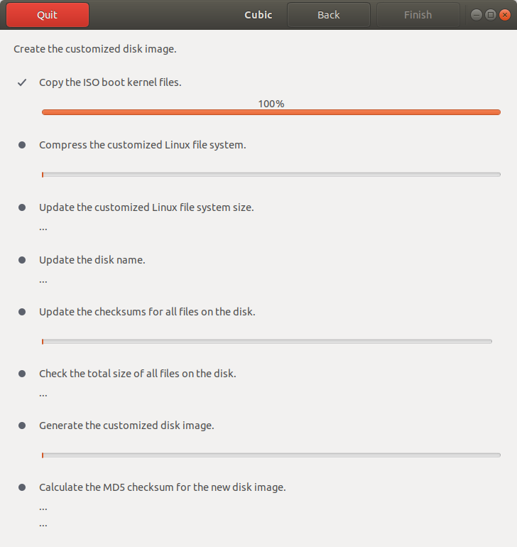

Once complete you may choose to delete the working files

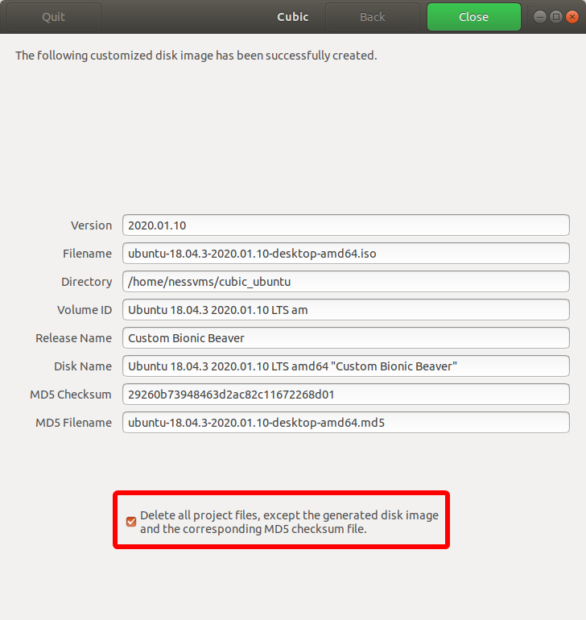


## Write USB ISO To USB Stick
Now that the ISO is created, open the file manager, navigate to home/cubic_ubuntu
Right click on the new image file and Open with Disk Image Writer

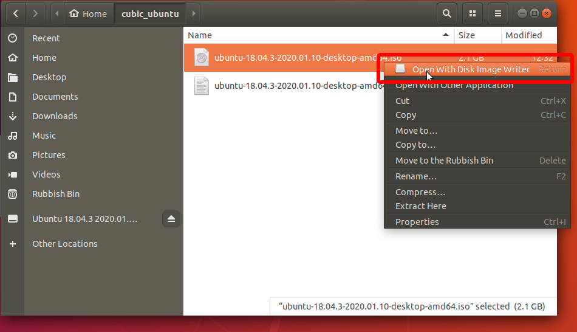

Write the file to a blank USB Stick that is larger than 4gb

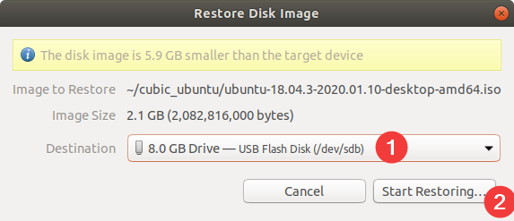
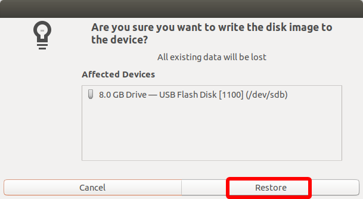


Congratulations, You're done.
Try the disk out on a new machine. REMEMBER this disk will wipe the contents of any machine you commence the install on.

#### Bug or suggestion?
Feel free to report any problem :)
Contact Kieran for changes.

## License
MIT License

Copyright (c) 2019 Ness Corporation

Permission is hereby granted, free of charge, to any person obtaining a copy
of this software and associated documentation files (the "Software"), to deal
in the Software without restriction, including without limitation the rights
to use, copy, modify, merge, publish, distribute, sublicense, and/or sell
copies of the Software, and to permit persons to whom the Software is
furnished to do so, subject to the following conditions:

The above copyright notice and this permission notice shall be included in all
copies or substantial portions of the Software.

THE SOFTWARE IS PROVIDED "AS IS", WITHOUT WARRANTY OF ANY KIND, EXPRESS OR
IMPLIED, INCLUDING BUT NOT LIMITED TO THE WARRANTIES OF MERCHANTABILITY,
FITNESS FOR A PARTICULAR PURPOSE AND NONINFRINGEMENT. IN NO EVENT SHALL THE
AUTHORS OR COPYRIGHT HOLDERS BE LIABLE FOR ANY CLAIM, DAMAGES OR OTHER
LIABILITY, WHETHER IN AN ACTION OF CONTRACT, TORT OR OTHERWISE, ARISING FROM,
OUT OF OR IN CONNECTION WITH THE SOFTWARE OR THE USE OR OTHER DEALINGS IN THE
SOFTWARE.

